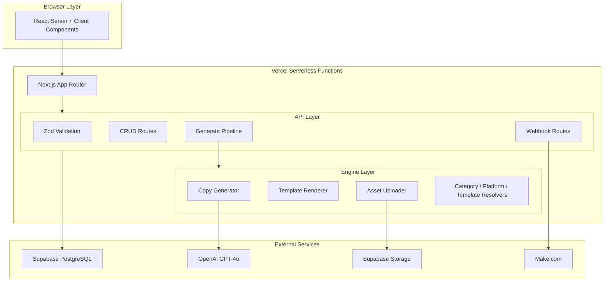
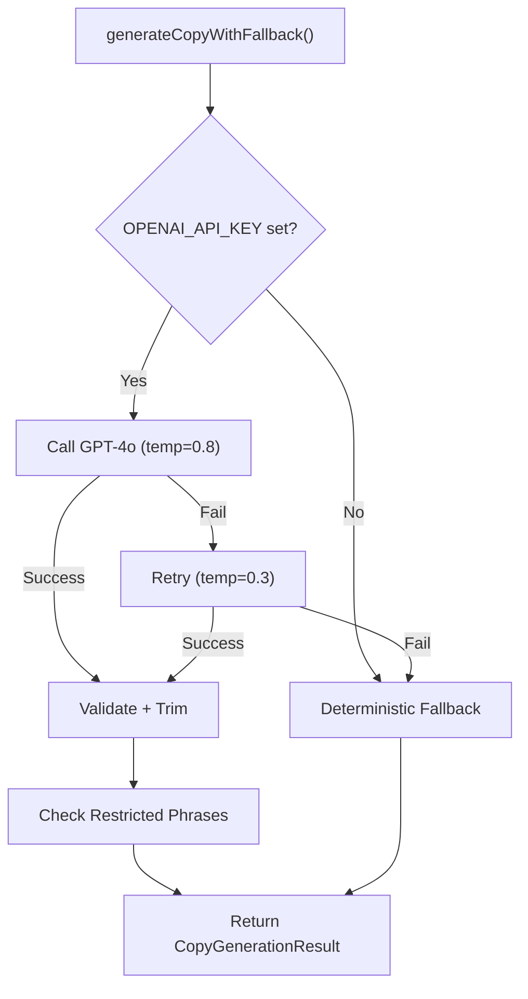
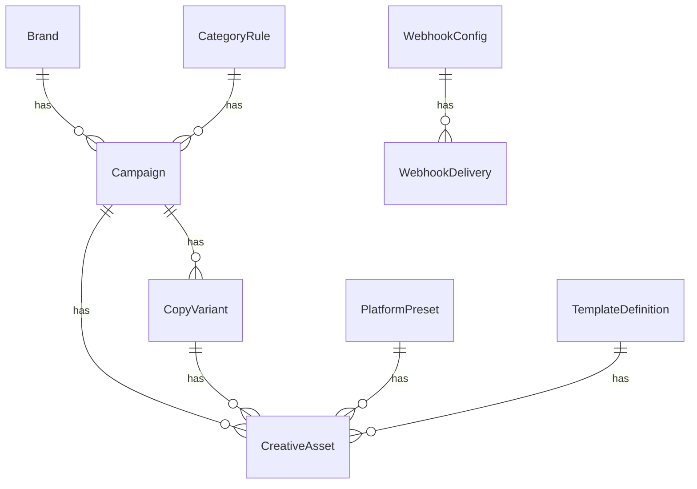
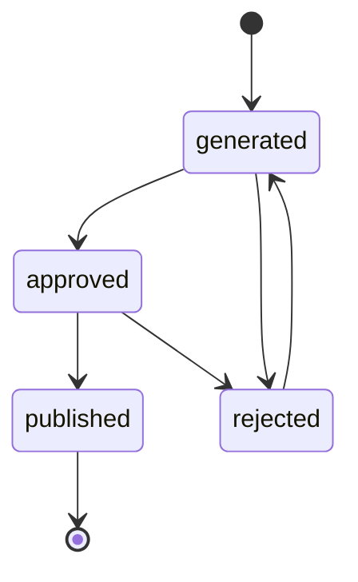

# Architecture

## 1. System Architecture Overview

The system follows a serverless monolith pattern: a single Next.js application deployed on Vercel handles both the UI and API layer. External services (Supabase, OpenAI) are integrated through their respective SDKs and REST APIs.



## 2. Major Subsystems

### 2.1 Frontend UI

**Technology:** Next.js 15 App Router, React 19 Server Components, Tailwind CSS

The UI consists of 13 pages organized around campaigns, brands, categories, and settings. Server components fetch data directly via Prisma (no additional API calls for page rendering). Client components handle interactive features (forms, status buttons, filters).

Key components:
- `CampaignForm` -- 4-step wizard for campaign creation
- `AssetGrid` -- filterable grid with lightbox, status badges, and inline approve/reject/publish buttons
- `RegenerateActions` -- client-side buttons that call regeneration API routes
- `Sidebar` -- persistent navigation

### 2.2 API Routes

**Pattern:** RESTful JSON API under `/api/v1/`

All routes use Next.js Route Handlers with:
- Zod validation on inputs
- Prisma for database access
- Consistent error response format: `{ error: string }`
- No authentication layer (designed for internal/trusted use)

The 18 routes break down into:
- **CRUD routes** (brands, campaigns, categories, presets, templates) -- standard list/get/create/update/delete
- **Pipeline route** (`/creatives/generate`) -- orchestrates the full generation flow
- **Action routes** (regenerate-copy, regenerate-assets, asset status) -- targeted mutations
- **Webhook routes** (Make.com inbound, outbound config/test) -- automation integration

### 2.3 Copy Generation Engine

**File:** `lib/engine/copy-generator.ts`

The copy generator implements a dual-mode strategy:



**OpenAI mode:** Sends a structured prompt built from category keywords, tone, copy rules, and campaign context. Requests JSON response format. Validates returned structure. Retries once at lower temperature on failure.

**Fallback mode:** Combines category primary keywords with product name into deterministic headline/subcopy/CTA patterns. Always produces valid output. Used when API key is missing or all OpenAI attempts fail.

**Post-processing:** Both modes truncate text to `headline_max_chars`, `subcopy_max_chars`, `cta_max_chars` defined in category rules. Restricted phrases are logged but not blocked (post-generation warning).

### 2.4 Rendering Engine

**Files:** `lib/engine/template-renderer.ts`, `lib/templates/components/AdTemplate.tsx`

The rendering pipeline:

1. **Template Resolution** (`template-resolver.ts`): Maps category + preset to a specific template definition. Extracts style properties (colors, font sizes, weights, alignments) from the template's layer definitions.

2. **Text Fitting** (`lib/utils/text-overflow.ts`): Before rendering, `adjustFontSize()` dynamically scales headline, subcopy, and CTA font sizes to fit within the layout area. Uses CJK-aware character width estimation (Korean characters ≈ 1.0× fontSize, Latin ≈ 0.55× fontSize).

3. **JSX Rendering** (`AdTemplate.tsx`): A pure React component that produces a layout using absolute positioning and inline styles (Satori does not support CSS classes). Renders headline, subcopy, CTA button, badge, logo, and background.

4. **Satori** (`template-renderer.ts`): Converts the JSX tree into SVG. Requires font files as ArrayBuffer. Handles custom widths and heights per platform preset.

5. **Sharp**: Converts SVG buffer to PNG at the exact pixel dimensions.

**Font Loading** (`lib/utils/font-loader.ts`):
- Primary: reads TTF/WOFF files from `public/fonts/`
- Fallback: fetches from Google Fonts API (with Macintosh User-Agent for WOFF compatibility)
- Loads Inter (400, 700, 800) for Latin and Noto Sans KR (400, 700, 800) for Korean
- Font data is cached in memory across invocations

### 2.5 Storage Uploader

**File:** `lib/engine/asset-uploader.ts`

Dual-mode storage with automatic detection:

| Condition | Storage | URL Format |
|-----------|---------|------------|
| `NEXT_PUBLIC_SUPABASE_URL` + `SUPABASE_SERVICE_ROLE_KEY` set | Supabase Storage | `https://xxx.supabase.co/storage/v1/object/public/creative-assets/{campaignId}/{file}.png` |
| Keys not set + local dev | Local filesystem | `/generated-assets/{campaignId}/{file}.png` |
| Keys not set + Vercel | Throws error | N/A (read-only filesystem) |

Supabase upload uses upsert mode and returns the public URL. The bucket `creative-assets` must have public access enabled.

### 2.6 Database Layer

**Technology:** Prisma ORM with PostgreSQL

**Connection:** In production, uses Supabase's Transaction Pooler (port 6543) with `?pgbouncer=true&connection_limit=1` to avoid exhausting the connection pool in serverless.

**Prisma Client:** Singleton pattern via `lib/db/prisma.ts` with global caching to prevent multiple instances during development hot-reloading.

**Models:** 9 models with the following relationships:



### 2.7 Webhook Integration

**Outbound** (`lib/automation/make-webhook.ts`):
- Queries all active webhook configs matching the event type
- Sends HTTP POST with JSON payload
- Supports HMAC-SHA256 signature via shared secret
- Logs each delivery attempt (success or failure) to WebhookDelivery table
- 10-second timeout per delivery
- Non-blocking (fire-and-forget with error catching)

**Inbound** (`app/api/v1/webhooks/make/route.ts`):
- Accepts `create_campaign` (triggers full generation) and `get_status` (returns campaign data)
- Optional `MAKE_WEBHOOK_SECRET` header authentication
- Translates Make.com payload format to internal API format

## 3. Data Flow Diagram

```mermaid
flowchart LR
  Input["Campaign Input"] --> Validate["Zod Validation"]
  Validate --> LoadData["Load Brand + Category + Presets"]
  LoadData --> GenCopy["Generate Copy (OpenAI/Fallback)"]
  GenCopy --> SaveCopy["Save Copy Variants to DB"]
  SaveCopy --> RenderLoop["Render Loop"]

  subgraph renderLoop [For each Variant x Preset]
    ResolveTemplate["Resolve Template"]
    FitText["Fit Text to Layout"]
    RenderJSX["Render JSX via Satori"]
    ConvertPNG["Convert to PNG via Sharp"]
    Upload["Upload to Storage"]
    SaveAsset["Save Asset Record"]
  end

  RenderLoop --> ResolveTemplate --> FitText --> RenderJSX --> ConvertPNG --> Upload --> SaveAsset
  SaveAsset --> UpdateCampaign["Update Campaign Status"]
  UpdateCampaign --> DispatchWebhook["Dispatch Webhook"]
  DispatchWebhook --> Response["Return JSON Response"]
```



## 4. Request Lifecycle: UI to Final Asset

1. **Browser** → `POST /api/v1/creatives/generate` with campaign payload
2. **Zod** validates input schema (brand ID, category ID, platforms, etc.)
3. **Prisma** loads Brand, CategoryRule, PlatformPreset records
4. **Campaign** record created in DB with status `generating`
5. **Copy Generator** calls OpenAI or produces fallback copy
6. **CopyVariant** records saved to DB
7. **For each variant × preset:**
   - Template resolved from category's `templateMapping`
   - Template style extracted from layer definitions
   - `adjustFontSize()` scales text to fit layout areas
   - `AdTemplate` JSX rendered with all props
   - Satori converts JSX to SVG (with loaded fonts)
   - Sharp converts SVG to PNG buffer
   - PNG uploaded to Supabase Storage
   - `CreativeAsset` record saved to DB
8. Campaign status updated to `completed`
9. Webhook payload built and dispatched
10. JSON response returned with campaign ID, copy variants, asset URLs

## 5. Category Rule Engine Design

Each category defines a comprehensive rule set stored as JSON fields in the `CategoryRule` model:

```json
{
  "keywords": {
    "primary": ["ROI", "efficiency", "automation"],
    "secondary": ["workflow", "integration", "dashboard"],
    "cta_keywords": ["Start Free Trial", "Book a Demo"],
    "restricted": ["cheap", "guarantee"],
    "required": []
  },
  "tone": {
    "voice": "professional",
    "formality": "high",
    "emotion": "confident",
    "description": "Professional, data-driven, focuses on measurable outcomes"
  },
  "copyRules": {
    "headline_max_chars": 40,
    "subcopy_max_chars": 90,
    "cta_max_chars": 20,
    "headline_style": "action-oriented",
    "avoid_patterns": ["!!!"],
    "prompt_template": "..."
  },
  "visualDirection": {
    "style": "corporate-minimal",
    "colorMood": "blue-trust",
    "imageStyle": "abstract-gradient",
    "overlayOpacity": 0.7
  },
  "templateMapping": {
    "default": "tpl_corporate_minimal",
    "preset_overrides": {}
  }
}
```

The copy generator uses `keywords`, `tone`, and `copyRules` to build the OpenAI prompt. The renderer uses `visualDirection` and `templateMapping` to select and style templates.

## 6. Platform Preset Design

Platform presets define the rendering canvas:

| Field | Purpose |
|-------|---------|
| `width`, `height` | Exact pixel dimensions |
| `aspectRatio` | Display reference (e.g., "1:1", "4:5") |
| `fontScale` | Global font size multiplier (smaller presets get smaller text) |
| `safeZone` | Margins where no content should be placed |
| `layoutRules` | Absolute positions for headline, subcopy, CTA, logo, badge areas |

`layoutRules` contains `headline_area`, `subcopy_area`, `cta_area`, `logo_area`, and `badge_area`, each with `x`, `y`, `maxWidth`, `maxLines`, and optional `width`/`maxHeight`.

## 7. Template System Design

Templates define visual styling through a layers array:

```json
{
  "layers": [
    {
      "type": "background",
      "style": { "fallbackColor": "#0F172A", "overlayColor": "#000000", "overlayOpacity": 0.6 }
    },
    {
      "type": "headline",
      "style": { "color": "#FFFFFF", "fontSize": 48, "fontWeight": 800, "align": "left" }
    },
    {
      "type": "subcopy",
      "style": { "color": "#CBD5E1", "fontSize": 22, "fontWeight": 400, "align": "left" }
    },
    {
      "type": "cta",
      "style": { "bgColor": "brand.primaryColor", "textColor": "#FFFFFF", "fontSize": 18, "borderRadius": 12 }
    },
    {
      "type": "badge",
      "style": { "bgColor": "brand.accentColor", "textColor": "#FFFFFF", "fontSize": 14, "borderRadius": 20 }
    }
  ]
}
```

**Dynamic brand references:** Style values like `"brand.primaryColor"` are resolved at render time to the actual brand color.

**Layer extraction:** `extractTemplateStyle()` flattens the layers array into a `TemplateStyle` object that `AdTemplate` consumes.

## 8. Font Loading and Korean Rendering

**Challenge:** Satori requires fonts as ArrayBuffer. It supports TTF and WOFF but not WOFF2 or variable fonts.

**Solution:**
- Inter static weights (400, 700, 800) as TTF (~155KB each)
- Noto Sans KR static weights (400, 700, 800) as WOFF (~3MB each)
- Fonts loaded from `public/fonts/` with Google Fonts fallback
- Korean fonts downloaded using IE11 User-Agent trick to get WOFF instead of WOFF2

**CJK in AdTemplate:** Font families declared as `"Inter, Noto Sans KR"` -- Satori uses the first font for characters it covers (Latin) and falls back to the second (Korean).

**Vercel deployment:** `outputFileTracingIncludes` in `next.config.ts` ensures font files are bundled with serverless functions.

## 9. Text Fitting / Overflow Strategy

`adjustFontSize(text, baseFontSize, maxWidth, maxLines, minFontSize)`:

1. Start at `baseFontSize`
2. Estimate if text fits using character-width heuristics
3. If it doesn't fit, reduce font size by 2px
4. Repeat until it fits or `minFontSize` is reached
5. Return `{ fontSize, fits }`

**CJK-aware estimation:** `isCJK()` detects Korean, Chinese, and Japanese characters. CJK characters are estimated at 1.0× fontSize width; Latin characters at 0.55× fontSize width. This prevents Korean text from overflowing.

`estimateTextFit(text, fontSize, maxWidth, maxLines)` returns the truncated text with `"..."` ellipsis if it still exceeds bounds after font scaling.

## 10. Regeneration Design

**Copy Regeneration:**
- Deletes all CopyVariant records for the campaign (cascades to CreativeAsset)
- Runs `generateCopyWithFallback()` with current category rules
- Creates new CopyVariant records
- Resets campaign status to `draft`
- Does NOT automatically re-render assets (separate action)

**Asset Regeneration:**
- Deletes all CreativeAsset records (keeps CopyVariant)
- Re-runs the render loop with existing copy variants
- Uploads new PNGs to Supabase Storage
- Creates new CreativeAsset records
- Updates campaign status to `completed`

This separation allows operators to regenerate copy without losing the ability to compare, and to re-render assets (e.g., after template changes) without regenerating copy.

## 11. Asset Status Transition Design



Transitions are enforced server-side in `PATCH /api/v1/assets/[id]/status`. Invalid transitions return 400 with explanation of allowed transitions. The `publishedAt` timestamp is set when transitioning to `published`.

## 12. Fallback Strategy

| Component | Primary | Fallback | Trigger |
|-----------|---------|----------|---------|
| Copy Generation | OpenAI GPT-4o | Deterministic templates | API key missing or API error |
| Storage | Supabase Storage | Local filesystem | Storage keys missing (dev only) |
| Fonts | Local `public/fonts/` | Google Fonts API | Font file not found |
| Webhook Delivery | HTTP POST | Logged error | Target unreachable |

All fallbacks are automatic and transparent to the caller. The API response includes `copySource` field indicating which mode was used.

## 13. Error Handling Strategy

- **Zod validation errors** return 400 with structured error details
- **Not found errors** return 404 with descriptive message
- **OpenAI failures** fall back silently to deterministic copy
- **Rendering failures** propagate as 500 with error message
- **Storage failures** propagate as 500 with Supabase error details
- **Webhook delivery failures** are logged but never block the main response
- **Campaign status** is set to `failed` if the generate pipeline throws

## 14. Production-Readiness Design Notes

- `output: "standalone"` in Next.js config produces a self-contained deployment
- `serverExternalPackages` ensures Sharp and Satori use native Node.js binaries
- `outputFileTracingIncludes` bundles font files with serverless functions
- Transaction pooler (port 6543) with `connection_limit=1` prevents pool exhaustion
- `prisma generate` runs both at `postinstall` and `build` for reliability
- `embedded-postgres` moved to `devDependencies` to reduce production bundle

## 15. Known Trade-offs and Architectural Decisions

| Decision | Trade-off | Rationale |
|----------|-----------|-----------|
| Serverless monolith over microservices | Cold starts, function timeout limits | Simpler deployment, no service mesh needed for MVP |
| Satori over Puppeteer/Playwright | Limited CSS support, no animation | 10x faster, no browser binary needed, works in serverless |
| Supabase over S3 | Vendor coupling | Unified DB + Storage, generous free tier, simpler setup |
| Category rules as JSON fields | Less queryable than normalized tables | Flexible schema evolution, easy to edit via UI |
| Synchronous generation over queue | Longer API response times | Simpler architecture, no queue infrastructure needed |
| WOFF over TTF for Korean fonts | Larger download from Google Fonts | Satori compatibility requirement (WOFF2 not supported) |
| Transaction pooler over session pooler | Cannot use prepared statements | Required for serverless connection pooling |
