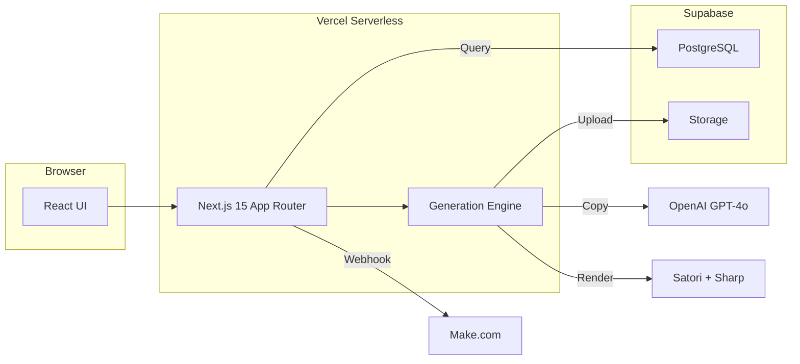

# Ad Creative Tool

> Automated ad creative generation platform that produces platform-specific, brand-consistent ad assets from structured campaign data.

**Live:** https://ad-creative-tool.vercel.app
**Stack:** Next.js 15 / TypeScript / PostgreSQL / Supabase / OpenAI GPT-4o / Satori + Sharp

---

## Problem Statement

Creating ad creatives is repetitive and error-prone. A single campaign needs multiple sizes for Meta and LinkedIn, each with category-appropriate copy and consistent branding. Manual production doesn't scale, and fully AI-generated banners produce unreliable text rendering.

## Why Template-Based Creative Automation

Most AI image generators bake text directly into pixels, making it impossible to guarantee typographic quality, character accuracy (especially for CJK languages), or brand consistency. This system separates concerns:

- **AI handles copy generation** -- GPT-4o writes headlines, subcopy, and CTAs guided by category-specific rules
- **Templates handle rendering** -- Satori converts React JSX into SVG with pixel-perfect text placement
- **Sharp handles export** -- SVG becomes high-resolution PNG at exact platform dimensions

This approach gives full control over typography, layout, brand colors, and font rendering while leveraging AI where it adds real value.

## Core Features

| Feature | Description |
|---------|-------------|
| **Campaign Generation** | Input product data, select category + platforms, get finished ad assets |
| **AI Copy with Fallback** | GPT-4o generates copy; deterministic fallback if API unavailable |
| **Multi-Platform Rendering** | Single campaign produces Meta (1080x1080, 1080x1350, 1080x1920) and LinkedIn (1200x1200, 1200x627) |
| **Category Rule Engine** | Keywords, tone, copy rules, visual direction, template mapping per category |
| **Brand Consistency** | Configurable colors, fonts, logo per brand |
| **Asset Status Workflow** | generated → approved → published with reject/reset paths |
| **Regeneration** | Regenerate copy independently or re-render all assets |
| **Webhook Integration** | Make.com inbound (trigger campaigns) and outbound (completion events) |
| **Korean Font Support** | Noto Sans KR bundled for CJK rendering with CJK-aware text fitting |
| **Cloud Storage** | Assets uploaded to Supabase Storage with public URLs |

## Architecture Overview



## Tech Stack

| Layer | Technology | Role |
|-------|-----------|------|
| Frontend | Next.js 15, React 19, Tailwind CSS | App Router, server components, dark-mode UI |
| API | Next.js Route Handlers | 18 REST endpoints under `/api/v1/` |
| Database | PostgreSQL via Prisma | 9 models, type-safe queries |
| AI | OpenAI GPT-4o | Copy generation with JSON response format |
| Rendering | Satori + Sharp | JSX → SVG → PNG server-side |
| Storage | Supabase Storage | Public bucket for generated assets |
| Validation | Zod | Request schema validation |
| Hosting | Vercel | Serverless, standalone output |
| Automation | Make.com | Webhook-based workflow integration |

## End-to-End Workflow

1. User fills campaign form: brand, category, product info, target platforms
2. API resolves category rules (keywords, tone, copy constraints)
3. GPT-4o generates copy variants (headline, subcopy, CTA) or fallback kicks in
4. For each copy variant × platform preset combination:
   - Template is resolved from category-platform mapping
   - Satori renders JSX template with brand colors, fonts, copy, and layout rules
   - Sharp converts SVG to PNG at exact pixel dimensions
   - PNG uploads to Supabase Storage
5. Campaign record + copy variants + asset metadata saved to PostgreSQL
6. Webhook dispatched to registered endpoints (creative.completed)
7. User reviews assets, approves/rejects, then publishes

**Example:** 3 copy variants × 5 platform presets = 15 assets per campaign, generated in ~40 seconds.

## API Summary

| Method | Endpoint | Purpose |
|--------|----------|---------|
| `POST` | `/api/v1/creatives/generate` | Full creative pipeline |
| `PATCH` | `/api/v1/assets/[id]/status` | Asset status transitions |
| `POST` | `/api/v1/campaigns/[id]/regenerate-copy` | Regenerate copy variants |
| `POST` | `/api/v1/campaigns/[id]/regenerate-assets` | Re-render all assets |
| `POST` | `/api/v1/webhooks/make` | Make.com inbound webhook |
| `GET` | `/api/v1/brands` | List brands |
| `GET` | `/api/v1/categories` | List category rules |
| `GET` | `/api/v1/presets` | List platform presets |

See [API_REFERENCE.md](API_REFERENCE.md) for complete documentation.

## Deployment Summary

| Service | Purpose |
|---------|---------|
| **Vercel** | Hosting (standalone output, serverless functions) |
| **Supabase PostgreSQL** | Database (transaction pooler for serverless) |
| **Supabase Storage** | Asset file storage (public bucket) |
| **OpenAI** | GPT-4o copy generation |
| **GitHub** | Source control, Vercel CI/CD trigger |

See [DEPLOYMENT.md](DEPLOYMENT.md) for setup instructions.

## Storage and Rendering Flow

**Rendering:** Campaign data → AdTemplate (React JSX) → Satori (SVG) → Sharp (PNG buffer)

**Storage:** PNG buffer → Supabase Storage upload → public URL returned → URL saved in CreativeAsset record

**Font Loading:** TTF/WOFF files from `public/fonts/` → loaded as ArrayBuffer → passed to Satori. Inter for Latin, Noto Sans KR for Korean/CJK. Google Fonts API fallback if local files missing.

## Regeneration and Approval Flow

**Regenerate Copy:** Deletes existing copy variants and all linked assets. Generates fresh copy from OpenAI (or fallback). Campaign resets to `draft`. Assets must be re-rendered separately.

**Regenerate Assets:** Keeps existing copy. Deletes old assets. Re-renders all variant × preset combinations. Uploads new PNGs.

**Approval Flow:**
```
generated ──→ approved ──→ published (final)
    │              │
    └──→ rejected ←┘
           │
           └──→ generated (reset)
```

## Make.com Webhook Integration

**Inbound** (`POST /api/v1/webhooks/make`):
- `create_campaign`: triggers full creative generation from Make scenario
- `get_status`: returns campaign status and asset URLs

**Outbound** (automatic):
- `creative.completed`: dispatched when generation finishes successfully
- `creative.failed`: dispatched on generation error

Both support HMAC signature verification via shared secret.

## Current Limitations

- Background images are prompt-only (no DALL-E generation yet)
- No bulk campaign creation from CSV/spreadsheet
- No real-time preview before generation
- No manual editing of generated assets
- Download All button is UI-only (not implemented)
- Single workspace (no multi-tenant support)

## Future Roadmap

1. **AI Background Generation** -- DALL-E / Stable Diffusion integration
2. **Make.com Auto-Publishing** -- Post approved assets to Meta/LinkedIn
3. **Custom Template Builder** -- Drag-and-drop template editor
4. **A/B Testing** -- Compare copy variant performance
5. **Multi-language Copy** -- Simultaneous Korean/English/Japanese generation
6. **Performance Analytics** -- Platform API integration for asset performance tracking
7. **Approval Workflows** -- Role-based multi-step approval chains
8. **Bulk Operations** -- CSV import for mass campaign creation

## Data Models

| Model | Purpose |
|-------|---------|
| `Brand` | Brand identity: colors, fonts, logo |
| `CategoryRule` | Category-specific keywords, tone, copy rules, visual direction |
| `PlatformPreset` | Platform dimensions, layout rules, font scaling |
| `TemplateDefinition` | Template layers, styles, preset compatibility |
| `Campaign` | Campaign metadata linking brand + category + product |
| `CopyVariant` | Generated copy: headline, subcopy, CTA, keywords |
| `CreativeAsset` | Rendered asset: file URL, dimensions, status |
| `WebhookConfig` | Outbound webhook endpoints and event subscriptions |

## How This Project Evolved

1. **Local MVP** -- Next.js scaffolding, Satori rendering proof-of-concept, font loading debugging (variable fonts failed, WOFF2 failed, WOFF worked)
2. **Rendering Validation** -- Korean font support with Noto Sans KR, CJK-aware text fitting algorithm, multi-platform size rendering
3. **Database Integration** -- embedded-postgres for local development, Prisma schema with 9 models, seed data for 3 categories/5 presets/3 templates
4. **Pipeline Completion** -- E2E validation from API through rendering to file storage, fallback copy generator
5. **Production Features** -- OpenAI integration, asset status workflow, regeneration actions, Make.com webhooks
6. **Deployment** -- Supabase PostgreSQL + Storage migration, Vercel deployment, production validation (all tests passed)

---

## License

Private project. All rights reserved.
